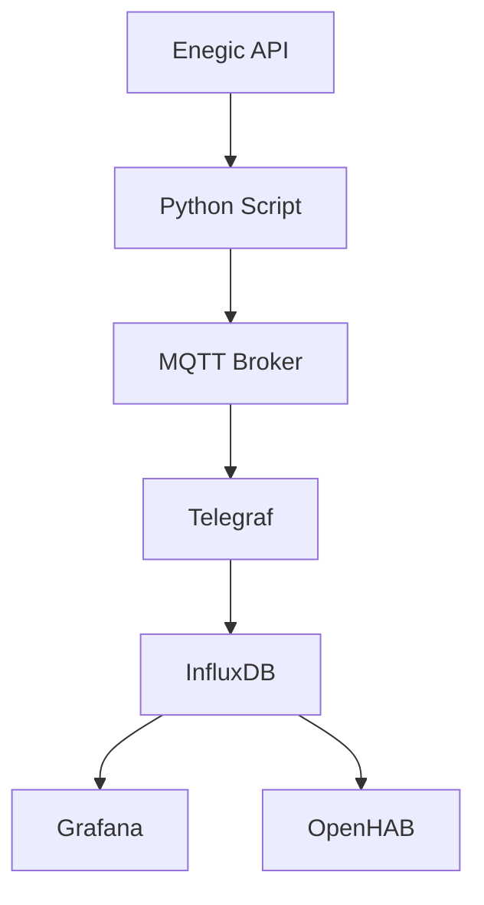

# enegic_mqtt

> ⚡️ Inspired by [PetrolHead2's Perific Meter project](https://github.com/PetrolHead2/perific-meter/tree/new-openapi) – the idea to interface with the Enegic API was proudly borrowed and adapted for this setup.

Small Python tool to poll data from the Enegic API and publish it to an MQTT broker. 

In my implementation (lets call it the reference implementation) i then read with Telegraf and write the data to Influx from where i can access it with Grafana. As there sometimes are gaps in the readings due to various outages I would like to add gaps and also history from before the script to Influxdb as well. See Section about History Reader below. I even have tried to specify the API in the OpenAPI format but not implemented the most of the methods.

I am not used to work in non POSEX. So in Linux or Mac please use the commands noted down. Otherwise please use the commands your OS supports. 

 
 > ⚠️ DISCLAIMER: I addition of course please see it as a highly experimental functionality. Especially the functionality in the API when it comes to actually control load balancing and charging can lead to unforseen conflicts with other members of the household or increased energy bill. ⚠️

---

## 🔧 Setup

```bash
export PYTHONPATH="$PWD/src"
python3 -m venv .venv
source .venv/bin/activate
pip install -r requirements.txt
```

---

## 🔄 Running

Both entry points read the same `config.yaml` (or the file pointed to by `ENEGIC_CONFIG_FILE`) for Enegic credentials and MQTT settings.

Both clients have a similar logic:
First they fetch the cached auth token. If there is no token cached it is getting renewed. Then the account details are getting read. If this call fails due to an auth error we can anticipate the token has expired and we first fetch a new token and retry again. Then the actual data is getting fetched.

### MQTT Publisher / Daemon

Continuously polls the API and publishes the latest values to MQTT:

```bash
python -m enegic_mqtt.mqtt_publisher
```

This is the module the Docker image launches by default.

### Manual API Client

Fetches the latest packets once, parses them, and prints the results to stdout – handy while developing or inspecting raw values:

```bash
export PYTHONPATH="$PWD/src"
source .venv/bin/activate
python -m enegic_mqtt.enegic_client
```

### History Reader

Pulls historical samples from `https://api.enegic.com/v1/sites/{site_id}/samples` and prints either derived totals or the raw payload (`--json`). Provide a start/end window and, if necessary, the site you want to backfill.

```bash
python -m enegic_mqtt.history_reader --from 2024-01-01 --to 2024-01-02T00:00:00 --resolution hour
```

How the site id is resolved (and cached into `.site_cache.json` for subsequent runs):

1. `--site-id` flag (if passed)
2. `enegic.site_id` in `config.yaml`
3. First `SiteId` exposed by `getaccountoverview` (then `/v1/sites` as a final fallback)

Helpful flags:

- `--chunk-hours`: split long ranges into manageable API calls (default 24h)
- `--json`: dump each chunk as JSON
- `--sleep-seconds` / `--retry-seconds`: tune pacing between calls

---

## 🛠️ Docker

Build the image on your Raspberry Pi (or any machine with Docker):

```bash
docker build -t enegic-mqtt .
```

Run the container with your configuration file mounted:

```bash
docker run -d \
  --name enegic-mqtt \
  -v /path/to/config.yaml:/config/config.yaml:ro \
  -e ENEGIC_CONFIG_FILE=/config/config.yaml \
  enegic-mqtt
```

---

## ⚙️ Example `config.yaml`

```yaml
enegic:
  token: "YOUR_ENEGIC_API_TOKEN"
  site_id: "YOUR_SITE_ID"
  poll_interval: 30
  timeout: 10

mqtt:
  host: "MQTT host"
  port: "MQTT port"
  topic_prefix: "enegic"
  qos: 0
  retain: false
  username: "mqtt_user"     # optional
  password: "mqtt_password" # optional
```

**Explanation:**

* `token`: Enegic API token from [https://api.enegic.com](https://api.enegic.com)
* `site_id`: numeric site ID from your account
* `poll_interval`: seconds between API requests
* `topic_prefix`: root topic for MQTT publications (e.g. `enegic/<site_id>/...`)

---

## 📊 Data Flow Overview



**Description:**

1. The Python script polls data from the Enegic API every 30 seconds.
2. Each measurement is published to MQTT under topics like:

   ```
   enegic/1724866924847/phase/realtime/current_L1 2.2
   enegic/1724866924847/phase/realtime/voltage_L1 234.6
   enegic/1724866924847/phase/day/energy 12.34
   ```
3. Telegraf subscribes to all topics (`enegic/#`) and writes values into InfluxDB.
4. Grafana and OpenHAB visualize or automate based on the same dataset.

---

## 🔢 Example Telegraf Config

```toml
[[inputs.mqtt_consumer]]
  servers = ["tcp://mqtt:1883"]
  topics = ["enegic/#"]
  data_format = "value"
  data_type = "float"
  name_override = "enegic"

[[outputs.influxdb]]
  urls = ["http://influx:8086"]
  database = "energy"
```

> 💡 Telegraf works with both **InfluxDB 1.x and 2.x**; configuration differs only in the output plugin (for 2.x use `[[outputs.influxdb_v2]]`). 

> ⚠️ In order to use the history reader a recent version of telegraf is needed. It has been tested with 1.36

---

## 📈 Grafana / OpenHAB Integration

* **Grafana:** visualize current, voltage, power, and phase data.
* **OpenHAB:** consume MQTT topics for automations or monitoring.

Example OpenHAB item:

```ini
Number EnCurrentL1 "Current L1 [%.2f A]" { channel="mqtt:topic:enegic:current_L1" }
```

---

## 🧩 MQTT Topic Structure

```
enegic/<site_id>/phase/realtime/current_L1
enegic/<site_id>/phase/realtime/current_L2
enegic/<site_id>/phase/realtime/current_L3
enegic/<site_id>/phase/realtime/voltage_L1
enegic/<site_id>/phase/realtime/voltage_L2
enegic/<site_id>/phase/realtime/voltage_L3
enegic/<site_id>/phase/realtime/power_total
enegic/<site_id>/phase/day/energy
enegic/<site_id>/device/temperature
enegic/<site_id>/device/status
```

---

## 🛂 Persistence & Backups

Persistence and backup depend on your chosen InfluxDB setup.

* Data is usually stored in `/srv/data/influxdb/`.
* The provided `ha-backup.sh` script performs daily local and offsite backups.

---

## 🧭 Monitoring & Troubleshooting

### 🔍 Logs

* **Python script:** Logs to stdout and Docker logs.

  ```bash
  docker logs -f enegic-mqtt
  ```

  Typical entries:

  * Successful API polling cycles
  * MQTT publish confirmations
  * Connection or timeout errors

* **Telegraf:**

  ```bash
  docker logs -f telegraf
  ```

  Shows connection status to MQTT and InfluxDB.

### 🧠 Debugging MQTT traffic

Use **MQTT Explorer** or `mosquitto_sub` to inspect live data:

```bash
mosquitto_sub -h 192.168.3.233 -t 'enegic/#' -v
```

Expected output:

```
enegic/1724866924847/phase/realtime/current_L1 2.3
enegic/1724866924847/phase/realtime/voltage_L2 231.7
```

### 📈 Verifying Influx Writes

List latest measurements:

```bash
influx -database 'energy' -execute 'SELECT * FROM enegic ORDER BY time DESC LIMIT 5'
```

### 🧰 Common Issues

| Symptom             | Likely Cause                        | Fix                                         |
| ------------------- | ----------------------------------- | ------------------------------------------- |
| No MQTT messages    | Wrong broker address or credentials | Check MQTT host/port in `config.yaml`       |
| Telegraf errors     | MQTT not reachable or wrong topic   | Verify topics and Docker network            |
| Influx not updating | Wrong database or output plugin     | Confirm `outputs.influxdb` vs `influxdb_v2` |
| Data gaps           | Script stopped or API timeout       | Check `docker ps` and logs                  |

---

## 🕒 Enegic History Reader

### Purpose

The **Enegic History Reader** supplements the realtime MQTT publisher by fetching historical or missing measurements from the Enegic API and publishing them to MQTT.
This helps fill potential data gaps caused by network issues, reboots, or API rate limits.

### Structure

```
/srv/stack/enegic/
├── src/enegic_mqtt/mqtt_publisher.py   # realtime publisher
├── src/enegic_mqtt/history_reader.py   # new history backfill script
├── requirements.txt
├── Dockerfile
└── (main docker-compose.yml lives one level up)
```

### Docker Integration

Both the realtime and history services share the same Docker image and dependencies.

Add the following to the main `/srv/stack/docker-compose.yml`:

```yaml
  enegic-realtime:
    build: ./enegic
    container_name: enegic-realtime
    restart: unless-stopped
    environment:
      TZ: Europe/Stockholm
      MQTT_BROKER: mqtt
      MQTT_PORT: 1883
    networks:
      - ha
    command: ["python", "-m", "enegic_mqtt.mqtt_publisher"]

  enegic-history:
    build: ./enegic
    container_name: enegic-history
    restart: unless-stopped
    environment:
      TZ: Europe/Stockholm
      MQTT_BROKER: mqtt
      MQTT_PORT: 1883
    networks:
      - ha
    command: ["python", "-m", "enegic_mqtt.history_reader"]
```

Then rebuild and start:

```bash
cd /srv/stack
docker compose build enegic-realtime enegic-history
docker compose up -d enegic-realtime enegic-history
```

### Scheduling

`history_reader.py` includes a simple internal loop:

```python
while True:
    fetch_missing_minutes()
    time.sleep(15 * 60)
```

This executes the historical data sync every 15 minutes.
Alternatively, you can trigger it externally (e.g. via cron) if you prefer.

### Logging

Logs are available via:

```bash
docker logs -f enegic-realtime
docker logs -f enegic-history
```

### Rebuild & Updates

If you change Python code or dependencies:

```bash
docker compose build --no-cache enegic-realtime enegic-history
docker compose up -d
```

---

## ⚖️ Disclaimer

This is based on the Open API specification done by PetrolHead2 which then has been enhanced. Perific is not publishing an official API and therefore no everything only is of course only a demonstration of capabilities and should not encourage to actually use it 😁😉

## 📜 License

MIT License
(c) 2025 Florian Wunderle
